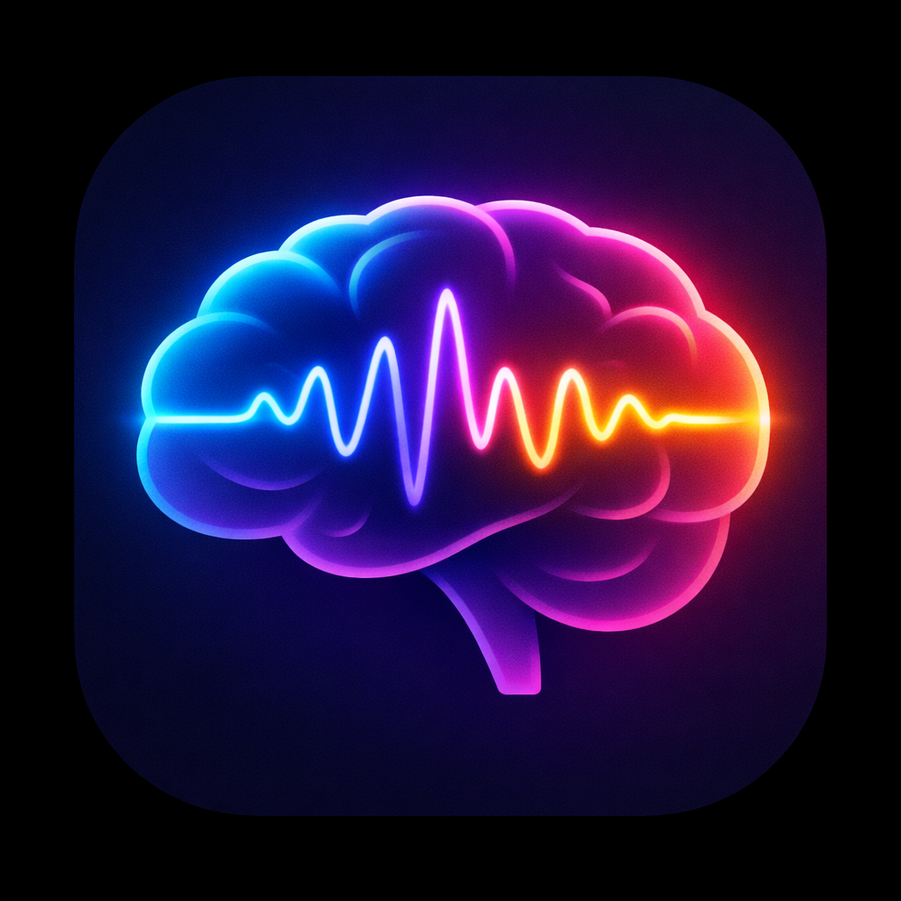
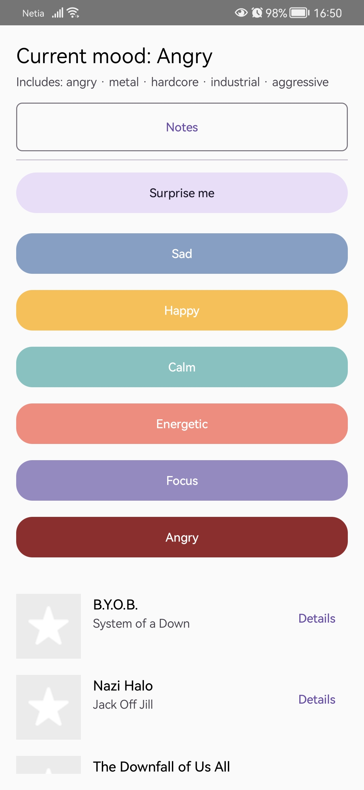
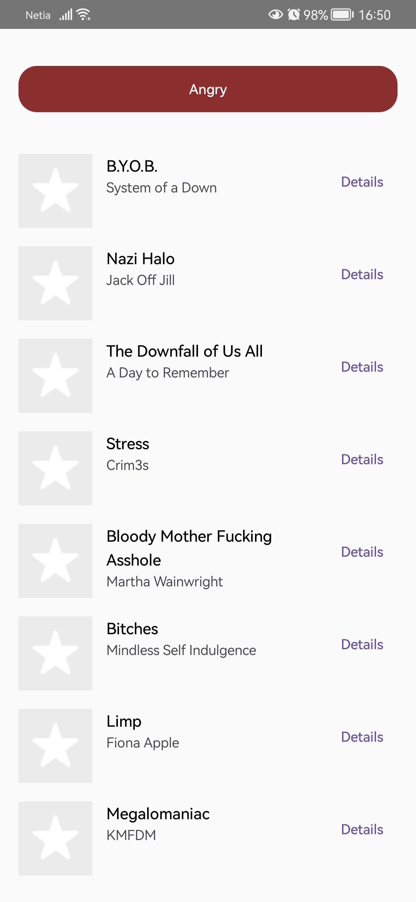
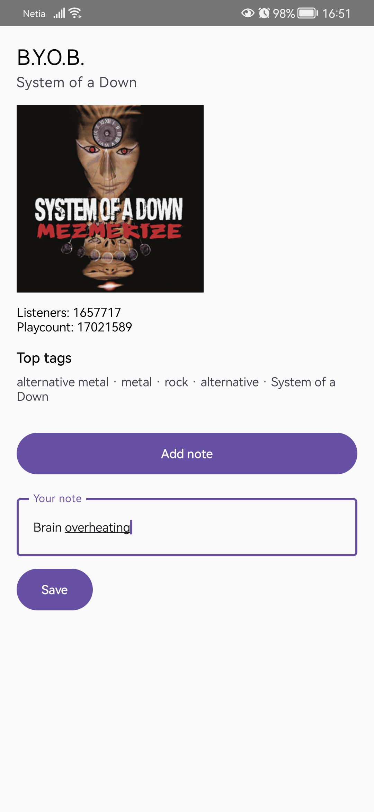
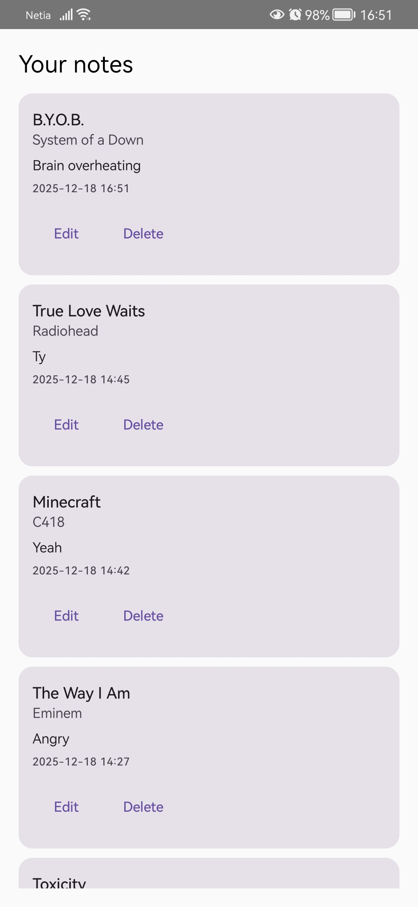

  

# Mood Music Diary

Mood Music Diary is an Android application for mood-based music discovery combined with personal annotation.
The application uses the Last.fm API to recommend tracks associated with emotional tags and allows the user to save selected tracks together with personal notes, forming a local music journal.

The app does not stream or play music. Its focus is on discovery, interpretation, and reflection.

---

## Functionality Overview

### Mood-based recommendations
The user selects a mood (e.g. calm, sad, happy, focus).
For each mood, the application queries Last.fm for tracks associated with a set of listener-generated tags related to that mood.

### Surprise mix
A special mode generates recommendations by combining multiple moods and their associated tags, producing less predictable results.

### Track details
For each recommended track, the user can view:
- artist name
- album artwork (if available)
- listener count
- play count
- top listener tags

### Notes (music diary)
The user can save any track together with a personal note:
- notes are stored locally on the device
- notes can be edited or deleted
- no user account or authentication is required

### Persistence
Notes are persisted using a local Room database.
Mood selection is restored between sessions using local storage.

## Application Screens

### Mood selection and recommendations

  

The main screen allows the user to select a mood (e.g. Calm, Sad, Happy).
Based on the selected mood, the application queries the Last.fm API using a predefined set of listener-generated tags and displays a list of recommended tracks.
Each mood is visually distinguished using a dedicated color to reinforce its emotional context.

---

### Track details

  
  

This screen displays extended metadata for a selected track, including artist information, album artwork, listener count, play count, and top listener tags.
The purpose of this screen is to provide transparency and explain why a given track appears in a specific mood-based recommendation.

---

### Notes (music diary)

  

The notes screen presents a list of tracks saved by the user together with personal annotations.
Notes are stored locally using a Room database and can be edited or deleted.
This feature allows the user to treat music discovery as a reflective process rather than a purely consumptive one.

---

## Technical Stack

- Language: Kotlin
- UI framework: Jetpack Compose (Material 3)
- Architecture: MVVM
- Networking: Retrofit
- Asynchronous state: Kotlin Coroutines, StateFlow
- Persistence: Room (SQLite)
- Navigation: Navigation Compose
- Image loading: Coil
- External API: Last.fm REST API

---

## Application Structure

- ui/
  Compose screens (Mood screen, Track details, Notes screen)

- viewmodel/
  ViewModels managing UI state and business logic

- data/
  Room database, DAO, and entity definitions

- api/
  Retrofit service definitions for Last.fm endpoints

- model/
  Data models for API responses and domain entities

---

## API Key Configuration

The application uses the Last.fm API.

For development purposes, the API key is currently hard-coded in the project.
For production or public release, the key should be moved to a secure configuration (BuildConfig or environment-based injection).

An API key can be obtained at:
https://www.last.fm/api

---

## Building and Running

1. Clone the repository:
   git clone https://github.com/poe-cat/MoodMusicDiary-v2

2. Open the project in Android Studio

3. Ensure the project is configured for:
    - Android Studio Hedgehog (or newer)
    - Jetpack Compose enabled
    - Minimum SDK compatible with Compose

4. Build and run on an emulator or physical device

---

## Known Limitations

- Track metadata quality depends on Last.fm availability and consistency.
- Some tracks may not return album artwork or detailed tag information.
- The application does not provide audio playback.

---

## Possible Extensions

- Automatic association of mood context with saved notes
- Search and filtering within notes
- Export or share notes
- Gesture-based note actions (e.g. swipe to delete)
- Support for Android themed (monochrome) app icons

---

## License and Attribution

This project is intended for educational purpose only.

Music metadata is provided by Last.fm under their API terms of service.
